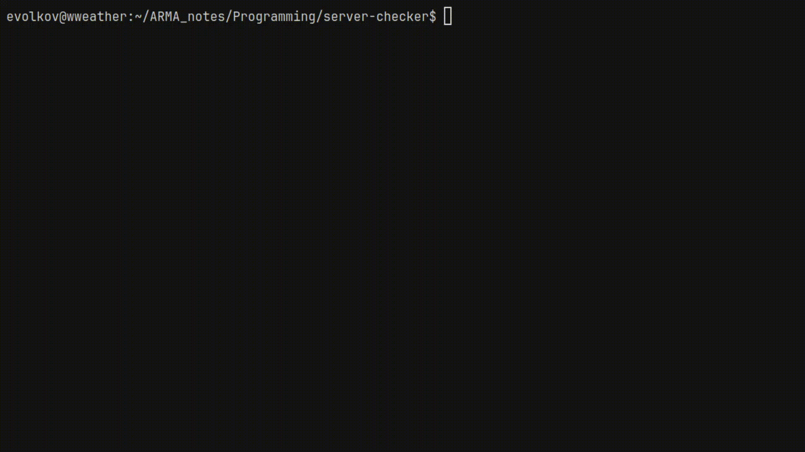

# server-checker
`server-checker` is a terminal-based hardware validation tool for Linux appliances and security platforms.

It collects system-level hardware data, validates it against predefined or custom YAML templates, and generates structured audit-ready reports.



# Contents

- [Why?](#why)
- [Installation](#installation)
  - [Build from source](#build-from-source)
- [System requirements](#system-requirements)
  - [Supported OS](#supported-os)
  - [Required system utilities](#required-system-utilities)
- [Usage](#usage)
- [Validate template](#validate-template)
- [Report output structure](#report-output-structure)

## Why?
After deploying a physical appliance, engineers often need to verify:
- Is the hardware correct?
- Does it match the specification?
- Are disks healthy?
- Are all NICs detected?
- Is the system compliant with internal standards?

`server-checker` automates this validation process and generates structured reports suitable for documentation and audits.

## Installation
### Build from source
Requires Go 1.20+
```bash
$ git clone https://github.com/w3athr/server-checker
$ cd server-checker
$ go mod tidy
$ go build -o server-checker ./cmd
```
Run:
```bash
sudo ./server-checker
```
Root privileges are recommended for full hardware inspection.

## System requirements
### Supported OS
Linux only:
- Debian / Ubuntu
- RHEL / Rocky / AlmaLinux
- Other modern Linux distributions with:
  - /sys
  - /proc
  - SMBIOS support
  - SMART support

Windows and macOS are not supported.
### Required system utilities
The following utilities must be available in PATH:
- ethtool
- smartctl
- lsblk
- dmesg
- lspci
- lsusb
- dmidecode 

Debian / Ubuntu:
```bash
sudo apt install ethtool smartmontools pciutils usbutils dmidecode
```
RHEL / Rocky:
```bash
sudo dnf install ethtool smartmontools pciutils usbutils dmidecode
```
## Usage
Launch interactive TUI:
```bash
sudo ./server-checker
```
Navigation:
- ↑/↓ or j/k — move
- Enter — select
- Q — exit
- ctrl+c — force quit 

Workflow:
1. Inspect hardware sections (System, CPU, RAM, Network, Disks)
2. Go to Report
3. Select validation template
4. Generate report

## Validate template
You can use embedded templates or define your own YAML profile.

Example:
```yaml
name: "My-Custom-Template"
description: "Describe target hardware configuration here"

cpu:
  # Minimum required physical cores
  min_cores: 0
  # Minimum required logical threads
  min_threads: 0
  # Minimum required base frequency in GHz
  min_speed_ghz: 0.0

ram:
  # Minimum total RAM in GB
  min_total_gb: 0

disks:
  # Minimum number of physical drives
  min_count: 0
  # Minimum size of each drive in GB
  min_size_gb: 0
  # Expected type: HDD / SSD / NVMe
  type: "SSD"

network:
  # Minimum number of total NIC ports
  min_total_nics: 0
```
Report → Select Template → Custom Template → provide absolute path to YAML file.

## Report output structure
```bash
HealthCheck-YYYY-MM-DD_HH-MM-SS/
├── report.txt
├── report.yaml
├── report.html
└── logs/
    ├── dmesg.txt
    ├── lspci-k.txt
    ├── lsusb.txt
    ├── lsblk.txt
    ├── product_name.txt
    ├── product_serial.txt
    ├── sys_vendor.txt
    └── smart_<device>.txt
```
Reports include:
- Validation summary (PASS / FAIL)
- Hardware inventory
- SMART disk health
- Network adapter overview
- Diagnostic command outputs
